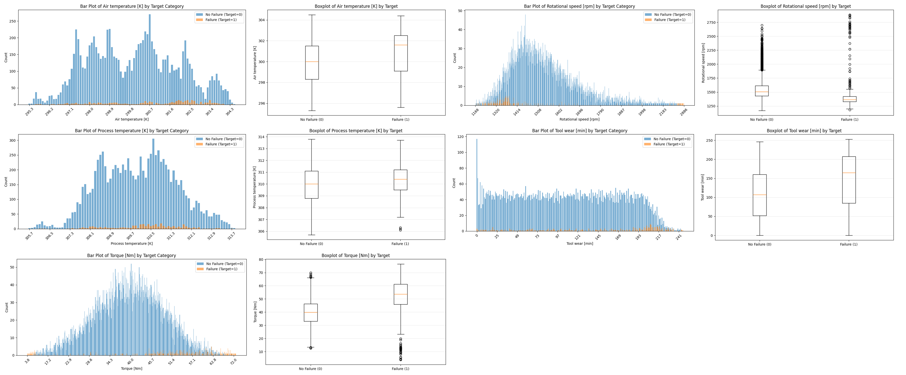
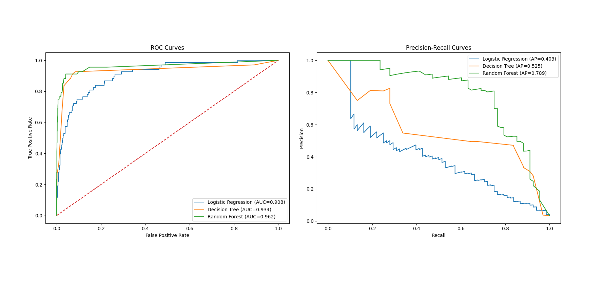
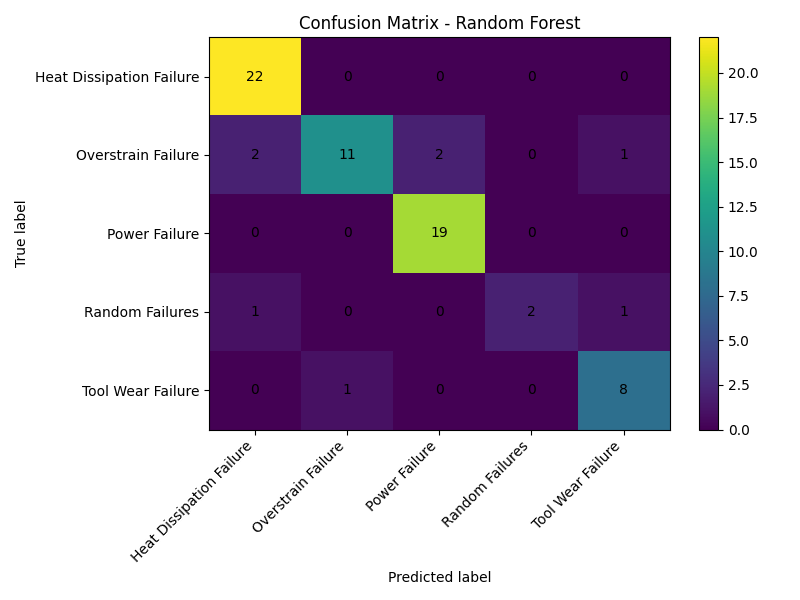
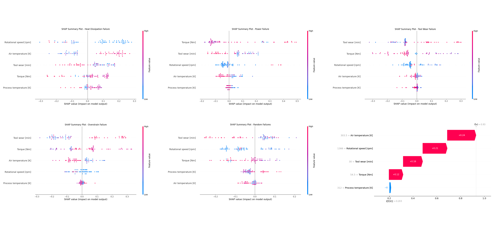

# Predictive Maintenance Analysis

This project builds an end-to-end predictive maintenance workflow on an industrial machine dataset. The goal is twofold: first, detect whether a machine is likely to fail; second, if failure occurs, identify the underlying failure mechanism. The analysis combines exploratory data analysis, statistical testing, binary classification, multiclass failure diagnosis, and model interpretation using SHAP. The repository structure and code support this workflow through dedicated scripts for statistical testing, binary modeling, multiclass modeling, and visualization. 

## Project at a Glance

**Problem.** Can sensor and operating variables be used to detect machine failure early, and can they also distinguish between different failure types?

**Data.** The project uses the Kaggle *Machine Predictive Maintenance Classification* dataset, with the main numeric predictors:
- Air temperature \[K]
- Process temperature \[K]
- Rotational speed \[rpm]
- Torque \[Nm]
- Tool wear \[min]

**Approach.**
1. Explore class-wise feature distributions.
2. Test whether failure and no-failure groups differ statistically.
3. Train binary classifiers on `Target`.
4. Train multiclass classifiers on `Failure Type` after removing `No Failure` rows.
5. Interpret the strongest model using SHAP. 

---

## Why This Project Matters

Predictive maintenance is not just a classification exercise. In a real operational setting, missed failures can lead to downtime, equipment damage, and costly interruptions. This makes the task inherently asymmetric: catching failures is often more important than maximizing overall accuracy. The project therefore emphasizes recall-sensitive evaluation, precision-recall analysis, and interpretable failure diagnosis rather than treating the problem as a generic balanced-class prediction task. That framing is also reflected in the modeling scripts, which use stratified train/test splitting and class-balanced learners. 

---

## Data and Feature Overview

The analysis focuses on five operational variables that are consistently used across the uploaded scripts:

- `Air temperature [K]`
- `Process temperature [K]`
- `Rotational speed [rpm]`
- `Torque [Nm]`
- `Tool wear [min]`

These variables are used for both statistical comparison and predictive modeling. The multiclass stage uses the same predictors but changes the target from overall failure status (`Target`) to failure mechanism (`Failure Type`). 

### Exploratory distributions

The first figure compares the distributions of the main numeric variables between `No Failure (0)` and `Failure (1)` using bar plots and boxplots. Visually, the failed class tends to occur at higher torque, higher tool wear, somewhat higher air and process temperature, and lower rotational speed. These class-level shifts already suggest that the selected variables contain predictive signal.

The plotting scripts were explicitly designed to compare the same variables by failure status, using sorted class-wise frequency plots and boxplots for direct visual inspection. 

---

## Analytical Workflow

### 1. Statistical comparison of failure vs. no failure

Before model training, the project tests whether the feature distributions differ between `Target = 0` and `Target = 1`. For each selected variable, the workflow computes:

- mean and median for both groups,
- standard deviation for both groups,
- Welch's t-test,
- Mann-Whitney U test.

This is a strong methodological choice because it shows that the predictive task is grounded in measurable class differences rather than purely black-box modeling. The statistical testing script also exports the comparison results to a CSV file for reproducibility. fileciteturn0file0L21-L61

### 2. Binary classification: failure detection

The binary stage predicts whether a machine observation is a failure case (`Target = 1`). Three baseline models are trained:

- Logistic Regression,
- Decision Tree,
- Random Forest.

The code uses a stratified 80/20 split, median imputation, standardization for logistic regression, and class balancing in all models. Evaluation includes confusion matrix, precision, recall, F1-score, ROC-AUC, and PR-AUC. These choices are appropriate because the problem is imbalanced and precision-recall behavior matters more than accuracy alone. 

### 3. Multiclass classification: failure diagnosis

The second stage excludes `No Failure` rows and predicts the specific failure mechanism. The same three model families are tested again, but now the target is `Failure Type`. The script encodes class labels, preserves class proportions via stratified splitting, evaluates with accuracy and macro/weighted F1, and prints a full confusion matrix and classification report for each model. 

### 4. Model interpretation with SHAP

The Random Forest model is then interpreted using SHAP. The workflow generates per-class SHAP summary plots, bar plots, and a waterfall explanation for one example prediction. This moves the project beyond performance reporting and provides feature-level reasoning for why a given failure type is predicted. 

---

## Results

### Binary classification performance

The ROC and precision-recall curves show a clear ranking among the three baseline models:

- **Logistic Regression:** ROC-AUC = **0.908**, AP = **0.403**
- **Decision Tree:** ROC-AUC = **0.934**, AP = **0.525**
- **Random Forest:** ROC-AUC = **0.962**, AP = **0.789**

This indicates that Random Forest is the strongest overall binary detector in this project. Its improvement is especially important on the precision-recall side, which is usually the more informative view under class imbalance.

These figures are consistent with the evaluation pipeline implemented in the binary modeling script, which computes both ROC-AUC and average precision after fitting all three models. 

### Main interpretation of the binary task

From the distribution plots and later importance analyses, the variables most closely associated with failure are:

- **Torque**
- **Tool wear**
- **Rotational speed**

In practical terms, failure cases tend to cluster around high torque, high wear, and lower rotational speed. Air temperature and process temperature also contribute, but they appear somewhat less dominant than the mechanical load and wear variables.

---

## Multiclass Failure-Type Analysis

The multiclass Random Forest confusion matrix shows that some failure types are learned very well, while rare or less distinct classes remain harder to classify.

Key observations from the confusion matrix:

- **Heat Dissipation Failure** is classified very strongly.
- **Power Failure** is also separated very well.
- **Tool Wear Failure** performs reasonably well.
- **Overstrain Failure** shows some confusion with nearby classes.
- **Random Failures** remains the hardest category, which is expected given its weaker structure and smaller sample size.

This pattern is aligned with the project logic in the multiclass script, which removes `No Failure` rows and then evaluates performance across the remaining failure mechanisms using confusion matrices and macro-level metrics. 

---

## What the SHAP Explanations Show

The SHAP visualizations provide the interpretability layer of the project. They show that different failure types are driven by different combinations of features rather than by a single universal rule.

Examples visible in the SHAP summary plots:

- **Heat Dissipation Failure** is strongly shaped by rotational speed and air temperature.
- **Power Failure** is heavily influenced by torque and tool wear.
- **Tool Wear Failure** is, unsurprisingly, strongly linked to tool wear, but also interacts with torque and rotational speed.
- **Overstrain Failure** is associated with high torque and higher tool wear.

The waterfall example also shows how an individual prediction is built up feature by feature, making the Random Forest output explainable at the single-case level.

The SHAP generation process, including class-wise summary plots and one local waterfall explanation, is implemented directly in the multiclass script. fileciteturn0file2L147-L239

---

## How to Explain This Project in an Interview or Portfolio

A concise explanation of the project could be:

> I built a predictive maintenance pipeline to solve two linked tasks: detect whether a machine is likely to fail, and then identify the likely failure mechanism. I started with exploratory analysis and statistical testing to verify that failure and non-failure groups differ meaningfully in variables such as torque, tool wear, rotational speed, and temperature. Then I trained Logistic Regression, Decision Tree, and Random Forest models for binary failure detection and multiclass failure diagnosis. Random Forest performed best in the binary setting, reaching a ROC-AUC of 0.962 and an average precision of 0.789. I then used SHAP to explain which features drive specific failure-type predictions, so the project delivers both predictive performance and interpretable maintenance insight.

That structure answers the key questions a reviewer usually cares about: what problem was solved, what data was used, why the approach is credible, what the main results were, and what practical insight was learned.

---

## Repository Contents

- `stat_testing.py` — statistical comparison of failure vs. no-failure groups, including Welch's t-test and Mann-Whitney U test, plus boxplots.
- `readit.py` — class-wise bar plot generation for the main numeric variables. 
- `models.py` — binary classification workflow with Logistic Regression, Decision Tree, and Random Forest, plus ROC and precision-recall analysis. 
- `multi_failure.py` — multiclass failure-type prediction and SHAP-based interpretation. 

---

## Limitations

This is already a solid portfolio project, but several limitations should be stated clearly:

- The evaluation appears to rely on a **single train/test split**, so results may vary across splits.
- The README figures demonstrate strong model performance, but a more formal summary table of precision, recall, and F1 by model would improve reporting.
- The project uses only the main numeric variables, so there is room for engineered features such as temperature difference, power-like interactions, or nonlinear condition indicators.
- Rare classes, especially **Random Failures**, remain difficult to model robustly.

These limitations are already hinted at by the current workflow design and by the observed confusion among minority classes.

---

## Possible Next Improvements

- Add cross-validation instead of a single split.
- Tune hyperparameters systematically.
- Optimize the binary decision threshold for maintenance priorities.
- Engineer features such as `process temperature - air temperature`.
- Add calibration analysis and error analysis.
- Expand the README with a compact metrics table exported from the scripts.

---

## Dataset Source

This project uses the following dataset:

[Kaggle: Machine Predictive Maintenance Classification](https://www.kaggle.com/datasets/shivamb/machine-predictive-maintenance-classification)
